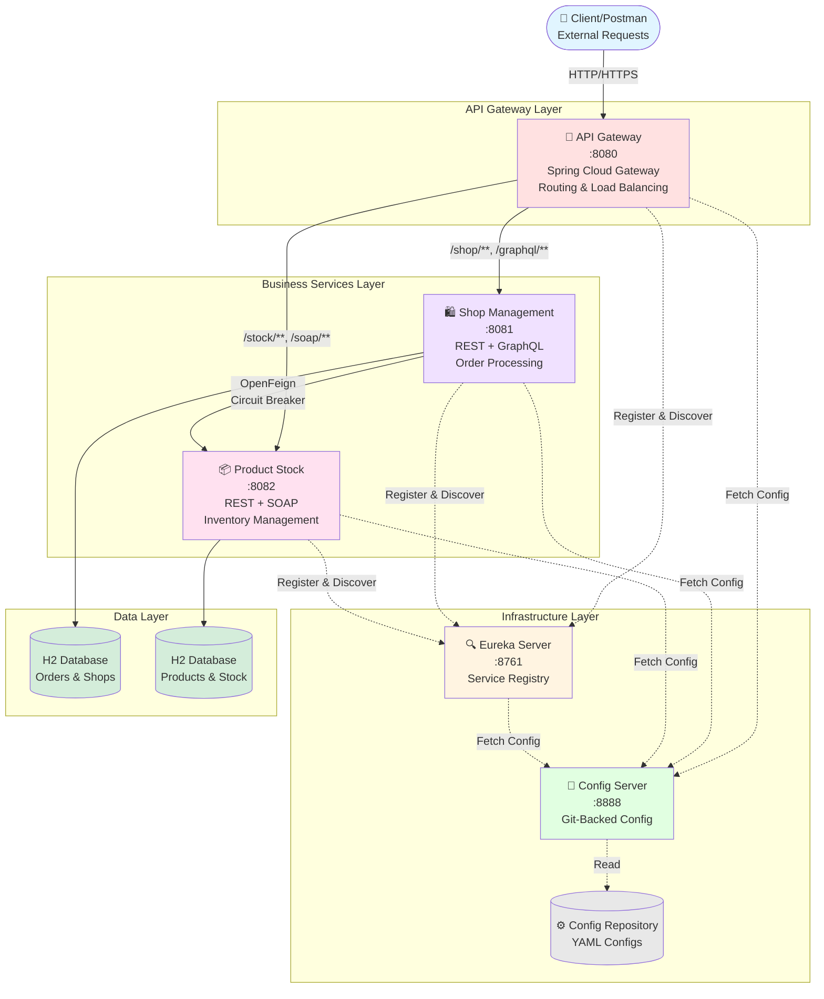
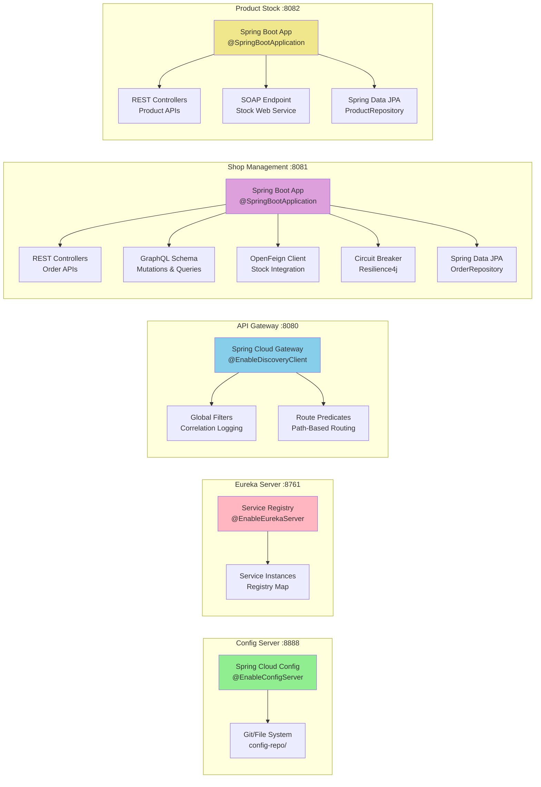
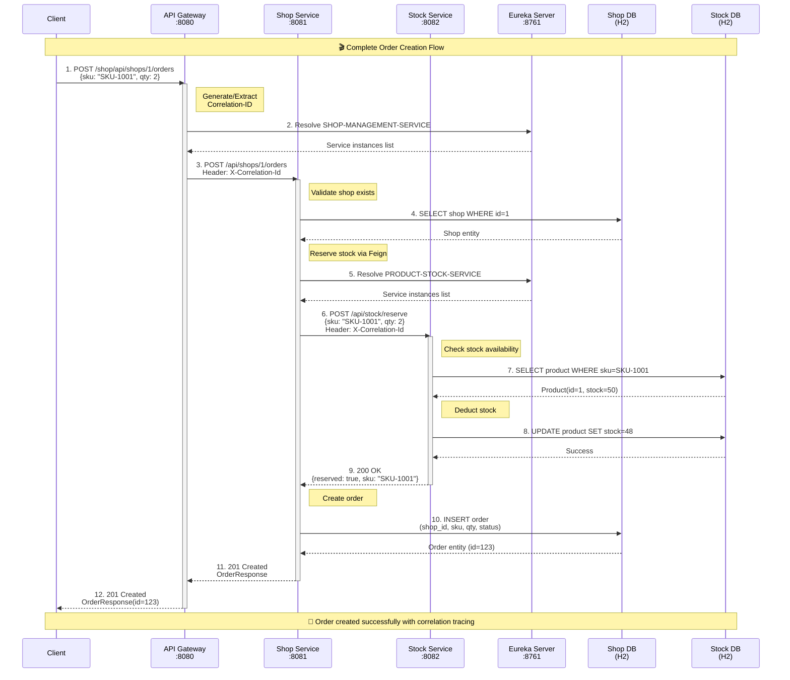
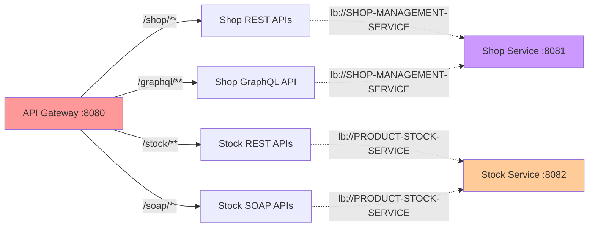
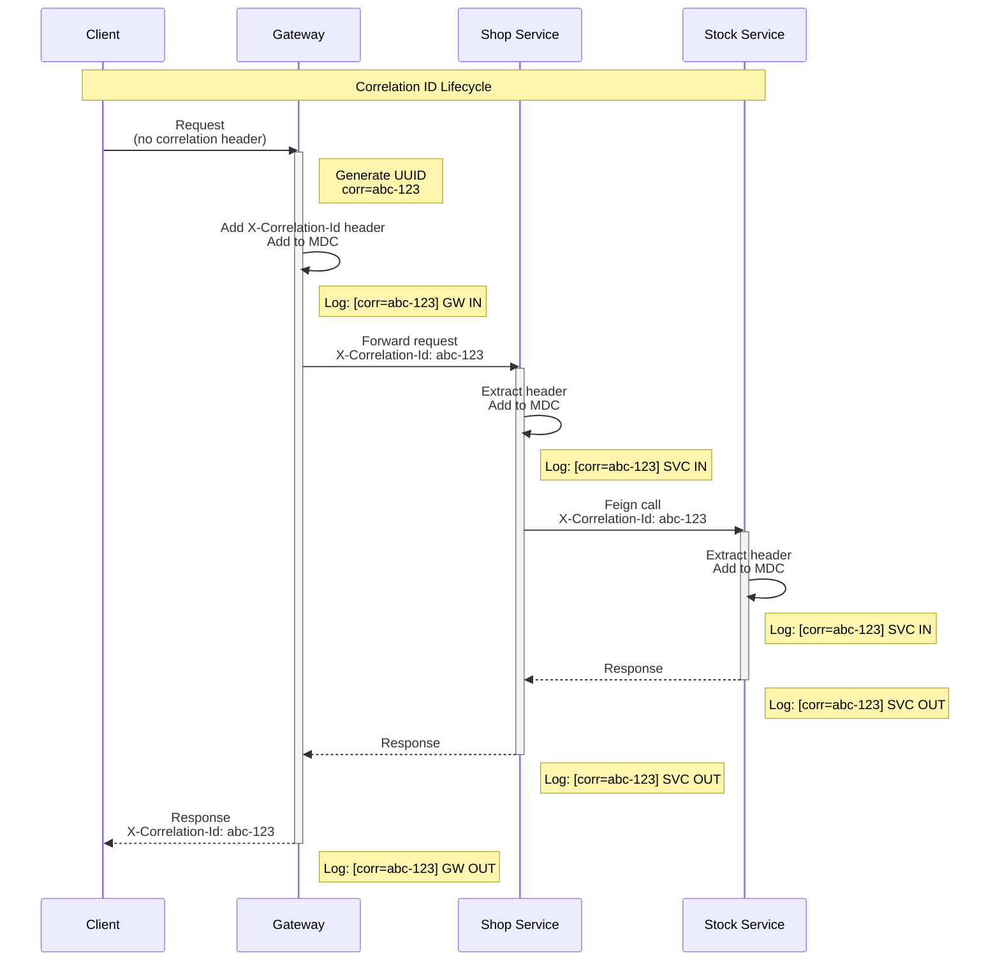

<div align="center">

# 🎬 Netflix OSS Microservices Architecture

### Enterprise-Grade Distributed System with Spring Cloud Netflix

[](https://openjdk.java.net/)
[](https://spring.io/projects/spring-boot)
[](https://spring.io/projects/spring-cloud)
[](https://maven.apache.org/)
[](LICENSE)

**A production-ready microservices architecture demonstrating Netflix OSS patterns with REST, SOAP, GraphQL APIs, distributed tracing, and resilient inter-service communication.**

[Features](#-key-features) •
[Architecture](#-system-architecture) •
[Quick Start](#-quick-start) •
[API Documentation](#-api-documentation) •
[Java Concepts](#-java--spring-concepts-used)

</div>

---

## 📋 Table of Contents

- [Overview](#-overview)
- [Key Features](#-key-features)
- [System Architecture](#-system-architecture)
- [Microservices Breakdown](#-microservices-breakdown)
- [Technology Stack](#-technology-stack)
- [Java & Spring Concepts](#-java--spring-concepts-used)
- [Quick Start](#-quick-start)
- [API Documentation](#-api-documentation)
- [Request Flow](#-request-flow--distributed-tracing)
- [Configuration](#-configuration-management)
- [Testing](#-testing-with-postman)
- [Monitoring & Observability](#-monitoring--observability)

---

## 🎯 Overview

This project is a **comprehensive microservices ecosystem** built with **Spring Cloud Netflix** stack, demonstrating real-world patterns for building scalable, resilient distributed systems. It showcases a complete e-commerce order management system with product inventory, implementing multiple communication protocols (REST, SOAP, GraphQL) and enterprise patterns.

### 🎪 What Makes This Project Special?

- **🔄 Multi-Protocol Support**: REST, SOAP, and GraphQL in a single ecosystem
- **🎭 Service Discovery**: Eureka-based dynamic service registration & discovery
- **🔐 Centralized Configuration**: Spring Cloud Config with Git-backed configuration
- **🚪 API Gateway**: Single entry point with intelligent routing & load balancing
- **🔗 Distributed Tracing**: Correlation ID propagation across all services
- **⚡ Circuit Breakers**: Resilience4j for fault tolerance
- **📊 Inter-Service Communication**: OpenFeign declarative HTTP clients
- **🗄️ Database**: JPA/Hibernate with H2 in-memory databases
- **📝 Structured Logging**: Request/response logging with sensitive data masking
- **🚀 Production-Ready**: Actuator health checks, metrics, and log aggregation

---

## ✨ Key Features

<table>
<tr>
<td width="50%">

### 🏗️ Architecture Patterns
- ✅ Service Registry & Discovery
- ✅ API Gateway Pattern
- ✅ Externalized Configuration
- ✅ Circuit Breaker Pattern
- ✅ Load Balancing (Client-Side)
- ✅ Correlation ID Pattern

</td>
<td width="50%">

### 🔧 Technical Features
- ✅ Multi-Module Maven Project
- ✅ RESTful API Design
- ✅ SOAP Web Services (JAXB)
- ✅ GraphQL Mutations & Queries
- ✅ Spring Data JPA
- ✅ Exception Handling Strategy

</td>
</tr>
</table>

---

## 🏛️ System Architecture



### 📊 Architecture Layers Explained

| Layer | Components | Responsibility |
|-------|-----------|----------------|
| **Infrastructure** | Config Server, Eureka Server | Foundation services for configuration and service discovery |
| **Gateway** | API Gateway | Single entry point, routing, load balancing, CORS handling |
| **Business Logic** | Shop Service, Stock Service | Core business capabilities and domain logic |
| **Data Persistence** | H2 Databases | In-memory data storage for orders and inventory |

---

## 🎨 Microservices Breakdown



### 🔍 Service Details

#### 1️⃣ Config Server (Port 8888)
```yaml
Purpose: Centralized configuration management
Tech: Spring Cloud Config Server
Storage: File-based (config-repo/)
Features:
  - Environment-specific configs
  - Refresh without restart
  - Encryption support
```

#### 2️⃣ Eureka Server (Port 8761)
```yaml
Purpose: Service registry and discovery
Tech: Netflix Eureka
Features:
  - Self-preservation mode
  - Instance health monitoring
  - Client-side load balancing
  - Dashboard UI
```

#### 3️⃣ API Gateway (Port 8080)
```yaml
Purpose: Single entry point for all clients
Tech: Spring Cloud Gateway (Reactive)
Features:
  - Path-based routing
  - Load balancing (lb://)
  - Correlation ID injection
  - Request/response logging
  - CORS configuration
```

#### 4️⃣ Shop Management Service (Port 8081)
```yaml
Purpose: Order management and shop operations
APIs:
  - REST: CRUD operations for orders
  - GraphQL: Query & mutation support
Communication:
  - OpenFeign → Stock Service
  - Circuit Breaker protection
Database: H2 (orders, shops)
```

#### 5️⃣ Product Stock Service (Port 8082)
```yaml
Purpose: Product inventory and stock management
APIs:
  - REST: Product catalog and stock operations
  - SOAP: Legacy integration for stock queries
Database: H2 (products, inventory)
```

---

## 🛠️ Technology Stack

<table>
<tr>
<td width="33%">

### Core Technologies
- ☕ **Java 17** (LTS)
- 🍃 **Spring Boot 3.2.6**
- ☁️ **Spring Cloud 2023.0.3**
- 🔨 **Maven** (Multi-Module)

</td>
<td width="33%">

### Spring Cloud Components
- 🔍 **Eureka** (Discovery)
- 🚪 **Gateway** (Routing)
- ⚙️ **Config** (Externalization)
- 🔌 **OpenFeign** (HTTP Client)
- ⚡ **Resilience4j** (Resilience)

</td>
<td width="33%">

### Additional Frameworks
- 🗄️ **Spring Data JPA**
- 🗃️ **H2 Database**
- 🧼 **JAXB** (SOAP)
- 📊 **GraphQL Java**
- 📝 **SLF4J + Logback**

</td>
</tr>
</table>

---

## 🎓 Java & Spring Concepts Used

This project is a **learning goldmine** for Java developers, demonstrating modern enterprise patterns:

### 🔷 Core Java Concepts

<details>
<summary><b>1. Object-Oriented Programming (OOP)</b></summary>

- **Encapsulation**: Entity classes, DTOs, configuration classes
- **Inheritance**: Exception hierarchy (`BusinessException`, `ResourceNotFoundException`)
- **Polymorphism**: Interface-based programming (repositories, services)
- **Abstraction**: Service layer abstractions, Feign client interfaces

**Example Locations:**
- [ProductEntity.java](product-stock-service/src/main/java/com/netflixoss/stock/entity/ProductEntity.java)
- [GlobalExceptionHandler.java](shop-management-service/src/main/java/com/netflixoss/shop/exception/GlobalExceptionHandler.java)

</details>

<details>
<summary><b>2. Functional Programming (Java 8+)</b></summary>

- **Lambda Expressions**: Stream operations, optional handling
- **Stream API**: Data filtering, mapping, collecting
- **Optional**: Null-safe operations in repositories
- **Method References**: Repository method references

**Common Patterns:**
```java
// Stream API usage
products.stream()
    .filter(p -> p.getStock() > 0)
    .map(ProductResponse::from)
    .collect(Collectors.toList());

// Optional handling
productRepository.findBySku(sku)
    .orElseThrow(() -> new ResourceNotFoundException("Product not found"));
```

</details>

<details>
<summary><b>3. Annotations & Reflection</b></summary>

- Custom annotations processing
- Spring's annotation-driven configuration
- Runtime annotation discovery
- AOP (Aspect-Oriented Programming) via annotations

**Key Annotations Used:**
- `@SpringBootApplication`, `@RestController`, `@Service`
- `@Entity`, `@Table`, `@Id`, `@GeneratedValue`
- `@FeignClient`, `@EnableDiscoveryClient`
- `@CircuitBreaker`, `@Retry`

</details>

<details>
<summary><b>4. Generics</b></summary>

- Generic repository interfaces
- Type-safe DTO transformations
- Generic exception handling
- Parameterized collections

**Example:**
```java
public interface ProductRepository extends JpaRepository<ProductEntity, Long> {
    Optional<ProductEntity> findBySku(String sku);
}
```

</details>

<details>
<summary><b>5. Exception Handling</b></summary>

- Checked vs unchecked exceptions
- Custom exception hierarchy
- Global exception handling with `@ControllerAdvice`
- Exception translation (JPA → Business)

**Hierarchy:**
```
RuntimeException
    └── BusinessException
        ├── ResourceNotFoundException
        └── InsufficientStockException
```

</details>

### 🌱 Spring Framework Concepts

<details>
<summary><b>6. Dependency Injection (DI) & Inversion of Control (IoC)</b></summary>

- **Constructor Injection**: Preferred method (immutable dependencies)
- **Field Injection**: `@Autowired` (legacy, limited use)
- **IoC Container**: Spring application context management
- **Bean Lifecycle**: Init/destroy callbacks, post-construct

**Example:**
```java
@Service
public class OrderService {
    private final OrderRepository orderRepository;
    private final StockReservationGateway stockGateway;
    
    // Constructor injection (recommended)
    public OrderService(OrderRepository orderRepository, 
                       StockReservationGateway stockGateway) {
        this.orderRepository = orderRepository;
        this.stockGateway = stockGateway;
    }
}
```

</details>

<details>
<summary><b>7. Spring Boot Auto-Configuration</b></summary>

- Convention over configuration
- Starter dependencies
- Conditional bean creation
- Externalized configuration
- Embedded server (Tomcat/Netty)

**Auto-Configured Components:**
- DataSource & JPA
- Web MVC / WebFlux
- Actuator endpoints
- Jackson JSON serialization

</details>

<details>
<summary><b>8. Spring Cloud Patterns</b></summary>

#### Service Discovery Pattern
```java
@EnableEurekaServer  // Eureka Server
@EnableDiscoveryClient  // Eureka Client
```
- Automatic service registration
- Health check heartbeats
- Dynamic service lookup

#### API Gateway Pattern
```java
@Configuration
public class GatewayConfig {
    // Route definitions with predicates
    // Load balancing: lb://SERVICE-NAME
}
```

#### Circuit Breaker Pattern
```java
@CircuitBreaker(name = "stockReservation", fallbackMethod = "fallback")
public StockReserveResult reserveStock(StockReserveRequest request) {
    // Protected call
}
```

#### Externalized Configuration
```java
@Value("${eureka.client.serviceUrl.defaultZone}")
private String eurekaUrl;
```

</details>

<details>
<summary><b>9. Spring Data JPA</b></summary>

- **Repository Pattern**: Abstraction over data access
- **Query Methods**: Derived queries from method names
- **JPQL**: Custom queries with `@Query`
- **Entity Relationships**: `@OneToMany`, `@ManyToOne`
- **Transactions**: `@Transactional` propagation

**Example:**
```java
public interface OrderRepository extends JpaRepository<OrderEntity, Long> {
    List<OrderEntity> findByShopId(Long shopId);
    
    @Query("SELECT o FROM OrderEntity o WHERE o.status = :status")
    List<OrderEntity> findByStatus(@Param("status") String status);
}
```

</details>

<details>
<summary><b>10. RESTful API Design</b></summary>

- HTTP methods: GET, POST, PUT, DELETE
- Resource-oriented URLs
- Status codes: 200, 201, 404, 500
- Richardson Maturity Model (Level 2)
- HATEOAS principles (basic)

**REST Controller Example:**
```java
@RestController
@RequestMapping("/api/products")
public class ProductController {
    
    @GetMapping
    public ResponseEntity<List<ProductResponse>> getAllProducts() { }
    
    @GetMapping("/{sku}")
    public ResponseEntity<ProductResponse> getProduct(@PathVariable String sku) { }
    
    @PostMapping("/reserve")
    public ResponseEntity<ReserveResponse> reserveStock(@RequestBody ReserveRequest) { }
}
```

</details>

<details>
<summary><b>11. SOAP Web Services (JAXB)</b></summary>

- **XML Marshalling/Unmarshalling**: JAXB annotations
- **Contract-First Approach**: XSD schema definition
- **Endpoint Mapping**: `@PayloadRoot`
- **WSDL Generation**: Automatic from XSD
- **Interceptors**: Request/response logging

**SOAP Endpoint:**
```java
@Endpoint
public class StockEndpoint {
    
    @PayloadRoot(namespace = NAMESPACE_URI, localPart = "getStockLevelRequest")
    @ResponsePayload
    public GetStockLevelResponse getStockLevel(@RequestPayload GetStockLevelRequest request) {
        // SOAP operation logic
    }
}
```

**Location:** [StockEndpoint.java](product-stock-service/src/main/java/com/netflixoss/stock/soap/StockEndpoint.java)

</details>

<details>
<summary><b>12. GraphQL API</b></summary>

- **Schema-First Design**: `.graphqls` schema files
- **Queries & Mutations**: Read and write operations
- **Resolvers**: `@QueryMapping`, `@MutationMapping`
- **DataFetchers**: Field-level resolvers
- **Partial Responses**: Client-defined data shape

**GraphQL Schema:**
```graphql
type Query {
    orderById(id: ID!): Order
}

type Mutation {
    createOrder(shopId: ID!, sku: String!, quantity: Int!): Order
}
```

**Controller:**
```java
@Controller
public class OrderGraphqlController {
    
    @QueryMapping
    public OrderResponse orderById(@Argument Long id) { }
    
    @MutationMapping
    public OrderResponse createOrder(@Argument GraphqlOrderPayload payload) { }
}
```

</details>

<details>
<summary><b>13. OpenFeign Declarative HTTP Client</b></summary>

- **Interface-Based**: No implementation needed
- **Service Discovery Integration**: Uses Eureka
- **Load Balancing**: Client-side with Ribbon/LoadBalancer
- **Request/Response Interceptors**: Custom headers
- **Error Handling**: ErrorDecoder customization

**Feign Client:**
```java
@FeignClient(
    name = "PRODUCT-STOCK-SERVICE",
    configuration = StockFeignConfig.class
)
public interface StockClient {
    
    @PostMapping("/api/stock/reserve")
    StockReserveResult reserveStock(@RequestBody StockReserveRequest request);
}
```

**Usage:**
```java
@Service
public class OrderService {
    private final StockClient stockClient;
    
    public OrderResponse createOrder(CreateOrderRequest request) {
        // Declarative HTTP call - no RestTemplate needed!
        StockReserveResult result = stockClient.reserveStock(stockRequest);
    }
}
```

</details>

<details>
<summary><b>14. Resilience Patterns (Resilience4j)</b></summary>

#### Circuit Breaker
```java
@CircuitBreaker(name = "stockReservation", fallbackMethod = "reserveStockFallback")
public StockReserveResult reserveStock(StockReserveRequest request) {
    return stockClient.reserveStock(request);
}

// Fallback when circuit is open
private StockReserveResult reserveStockFallback(StockReserveRequest request, Exception ex) {
    return StockReserveResult.failure("Service temporarily unavailable");
}
```

**Configuration:**
```yaml
resilience4j:
  circuitbreaker:
    instances:
      stockReservation:
        slidingWindowSize: 10
        failureRateThreshold: 50
        waitDurationInOpenState: 30000
```

**States:** CLOSED → OPEN → HALF_OPEN

</details>

<details>
<summary><b>15. Aspect-Oriented Programming (AOP)</b></summary>

- **Cross-Cutting Concerns**: Logging, security, transactions
- **Filters**: Servlet filters for request/response interception
- **Interceptors**: Feign interceptors, SOAP interceptors
- **Global Filters**: Gateway filters (reactive)

**Example - Correlation Logging Filter:**
```java
@Component
public class CorrelationLoggingFilter extends OncePerRequestFilter {
    
    @Override
    protected void doFilterInternal(HttpServletRequest request, 
                                   HttpServletResponse response,
                                   FilterChain filterChain) {
        String correlationId = extractOrGenerateCorrelationId(request);
        MDC.put("correlationId", correlationId);
        
        // Log request
        logRequest(request, correlationId);
        
        filterChain.doFilter(request, response);
        
        // Log response
        logResponse(response, correlationId);
        
        MDC.clear();
    }
}
```

</details>

<details>
<summary><b>16. Reactive Programming (Spring WebFlux)</b></summary>

- **API Gateway**: Built on Spring Cloud Gateway (reactive)
- **Non-Blocking I/O**: Netty server
- **Backpressure**: Reactive streams
- **Mono/Flux**: Reactive types (behind the scenes in Gateway)

**Note:** While business services use traditional Spring MVC (blocking), the API Gateway leverages reactive programming for high-throughput routing.

</details>

### 🏗️ Architecture & Design Patterns

<details>
<summary><b>17. Layered Architecture</b></summary>

```
┌─────────────────────────────────┐
│     Controller Layer            │ ← REST/GraphQL/SOAP endpoints
├─────────────────────────────────┤
│     Service Layer               │ ← Business logic
├─────────────────────────────────┤
│     Repository Layer            │ ← Data access
├─────────────────────────────────┤
│     Entity/Domain Layer         │ ← Domain models
└─────────────────────────────────┘
```

**Separation of Concerns:**
- Controllers: HTTP handling
- Services: Business rules
- Repositories: Persistence
- Entities: Domain models
- DTOs: Data transfer

</details>

<details>
<summary><b>18. DTO (Data Transfer Object) Pattern</b></summary>

- **Purpose**: Decouple API contracts from domain models
- **Mapping**: Entity ↔ DTO transformation
- **Validation**: `@Valid`, `@NotNull`, `@Size`
- **Immutability**: Use records (Java 14+) or final fields

**Example:**
```java
public record CreateOrderRequest(
    @NotBlank String sku,
    @Min(1) Integer qty
) {}

public record OrderResponse(
    Long id,
    Long shopId,
    String sku,
    Integer quantity,
    String status,
    LocalDateTime createdAt
) {
    public static OrderResponse from(OrderEntity entity) {
        return new OrderResponse(/* mapping */);
    }
}
```

</details>

<details>
<summary><b>19. Gateway Pattern</b></summary>

- **Single Entry Point**: All external traffic through gateway
- **Routing**: Path-based, header-based, predicate-based
- **Load Balancing**: Round-robin, weighted
- **Cross-Cutting**: CORS, authentication, rate limiting

**Route Configuration:**
```yaml
spring:
  cloud:
    gateway:
      routes:
        - id: shop-service
          uri: lb://SHOP-MANAGEMENT-SERVICE
          predicates:
            - Path=/shop/**, /graphql/**
```

</details>

<details>
<summary><b>20. Distributed Tracing (Correlation ID)</b></summary>

- **Problem**: Trace requests across multiple services
- **Solution**: Unique correlation ID per request
- **Propagation**: HTTP header `X-Correlation-Id`
- **Logging**: MDC (Mapped Diagnostic Context)

**Flow:**
```
1. Gateway generates/extracts correlation ID
2. Adds to X-Correlation-Id header
3. Services extract and add to MDC
4. All logs include [corr=xxx]
5. Feign client propagates to downstream calls
```

**Log Format:**
```
INFO [corr=abc-123] GW IN method=POST path=/shop/api/orders
INFO [corr=abc-123] SVC IN ShopService processing order
INFO [corr=abc-123] SVC OUT Calling StockService
INFO [corr=abc-123] SVC IN StockService received request
```

</details>

### 📦 Additional Concepts

<table>
<tr>
<td width="50%">

**21. Maven Multi-Module Project**
- Parent POM dependency management
- Module inheritance
- Shared properties
- Build reactor

**22. YAML Configuration**
- Environment-specific profiles
- Property placeholders
- Lists and nested objects

**23. Logging (SLF4J + Logback)**
- Structured logging
- Log levels (DEBUG, INFO, WARN, ERROR)
- Sensitive data masking
- MDC for context

</td>
<td width="50%">

**24. Actuator Endpoints**
- `/actuator/health` - Health checks
- `/actuator/info` - Application info
- `/actuator/metrics` - Metrics
- `/actuator/logfile` - Log streaming

**25. In-Memory Database (H2)**
- Development convenience
- Schema auto-generation
- Data initialization (data.sql)
- Console access

**26. Bean Validation (JSR-380)**
- `@NotNull`, `@NotBlank`
- `@Size`, `@Min`, `@Max`
- `@Email`, `@Pattern`
- `@Valid` cascade validation

</td>
</tr>
</table>

---

## 🚀 Quick Start

### Prerequisites

```bash
# Required
☕ Java 17 or higher
📦 Maven 3.8+
🖥️ Windows/Linux/MacOS

# Check installations
java -version
mvn -version
```

### 📥 Clone & Build

```bash
# Clone repository
git clone <repository-url>
cd Netflix-OSS

# Build all modules (skip tests for faster build)
mvn clean package -DskipTests

# Verify build artifacts
ls -R **/target/*.jar
```

### 🎬 Option 1: One-Command Startup (Recommended)

**PowerShell Script** - Starts services sequentially with health checks:

```powershell
# Navigate to scripts directory
cd scripts

# Run with default settings
powershell -ExecutionPolicy Bypass -File .\start-services.ps1

# Or with custom timeouts
powershell -ExecutionPolicy Bypass -File .\start-services.ps1 `
  -StartupTimeoutSeconds 420 `
  -PollIntervalSeconds 4
```

**What it does:**
1. ⏳ Waits for each service to be healthy before starting the next
2. 📋 Opens each service in a separate terminal window
3. 📊 Displays a status table with health URLs
4. ✅ Ensures proper startup order

**Output:**
```
Starting service: config-server (Port: 8888)
✓ config-server is healthy
Starting service: eureka-server (Port: 8761)
✓ eureka-server is healthy
...

┌─────────────────────────┬─────────┬────────────────────────────────┐
│ Service                 │ Status  │ Health URL                      │
├─────────────────────────┼─────────┼────────────────────────────────┤
│ config-server           │ ✓ UP    │ http://localhost:8888/actuator │
│ eureka-server           │ ✓ UP    │ http://localhost:8761/actuator │
└─────────────────────────┴─────────┴────────────────────────────────┘
```

### 🎬 Option 2: Manual Service Startup

**Start services in this order:**

```bash
# 1. Config Server (provides configuration to all services)
cd config-server
mvn spring-boot:run

# 2. Eureka Server (service registry)
cd eureka-server
mvn spring-boot:run

# 3. Product Stock Service (inventory backend)
cd product-stock-service
mvn spring-boot:run

# 4. Shop Management Service (order backend)
cd shop-management-service
mvn spring-boot:run

# 5. API Gateway (entry point)
cd api-gateway
mvn spring-boot:run
```

**⏱️ Wait time:** ~30 seconds per service to fully start

### ✅ Verify Startup

```bash
# Check all services are up
curl http://localhost:8888/actuator/health  # Config Server
curl http://localhost:8761/actuator/health  # Eureka Server
curl http://localhost:8082/actuator/health  # Stock Service
curl http://localhost:8081/actuator/health  # Shop Service
curl http://localhost:8080/actuator/health  # Gateway

# View Eureka Dashboard
open http://localhost:8761
```

**Expected Response:** `{"status":"UP"}`

### 🌐 Service URLs

| Service | Port | URL | Dashboard |
|---------|------|-----|-----------|
| **Config Server** | 8888 | http://localhost:8888 | [Actuator](http://localhost:8888/actuator) |
| **Eureka Server** | 8761 | http://localhost:8761 | [Dashboard](http://localhost:8761) |
| **API Gateway** | 8080 | http://localhost:8080 | [Routes](http://localhost:8080/actuator/gateway/routes) |
| **Shop Service** | 8081 | http://localhost:8081 | [Health](http://localhost:8081/actuator/health) |
| **Stock Service** | 8082 | http://localhost:8082 | [Health](http://localhost:8082/actuator/health) |

---

## 📡 API Documentation

### 🗺️ API Interaction Diagram



### 📋 Complete API Inventory

This system exposes **10 API operations** across **3 protocols**:

#### 🌐 REST APIs (6 operations)

<table>
<tr>
<th width="30%">Endpoint</th>
<th width="15%">Method</th>
<th width="20%">Service</th>
<th width="35%">Description</th>
</tr>

<tr>
<td><code>/shop/api/shops/{shopId}/orders</code></td>
<td><code>POST</code></td>
<td>Shop Management</td>
<td>Create a new order for a shop</td>
</tr>

<tr>
<td><code>/shop/api/orders/{orderId}</code></td>
<td><code>GET</code></td>
<td>Shop Management</td>
<td>Get order details by ID</td>
</tr>

<tr>
<td><code>/shop/api/shops/{shopId}/orders</code></td>
<td><code>GET</code></td>
<td>Shop Management</td>
<td>List all orders for a shop</td>
</tr>

<tr>
<td><code>/stock/api/products</code></td>
<td><code>GET</code></td>
<td>Product Stock</td>
<td>Get all products in catalog</td>
</tr>

<tr>
<td><code>/stock/api/products/{sku}</code></td>
<td><code>GET</code></td>
<td>Product Stock</td>
<td>Get product details by SKU</td>
</tr>

<tr>
<td><code>/stock/api/stock/reserve</code></td>
<td><code>POST</code></td>
<td>Product Stock</td>
<td>Reserve stock for a product</td>
</tr>
</table>

**Sample REST Request:**
```bash
curl -X POST http://localhost:8080/shop/api/shops/1/orders \
  -H "Content-Type: application/json" \
  -H "X-Correlation-Id: test-123" \
  -d '{
    "sku": "SKU-1001",
    "qty": 2
  }'
```

**Response:**
```json
{
  "id": 1,
  "shopId": 1,
  "sku": "SKU-1001",
  "quantity": 2,
  "status": "CREATED",
  "createdAt": "2026-02-08T10:30:00"
}
```

#### 🧼 SOAP APIs (2 operations)

<table>
<tr>
<th width="30%">Operation</th>
<th width="20%">Endpoint</th>
<th width="50%">Description</th>
</tr>

<tr>
<td><code>getStockLevel</code></td>
<td><code>POST /soap/ws</code></td>
<td>Query current stock level for a product SKU</td>
</tr>

<tr>
<td><code>restockProduct</code></td>
<td><code>POST /soap/ws</code></td>
<td>Add stock quantity to a product</td>
</tr>
</table>

**WSDL Location:** `http://localhost:8080/soap/ws/stock.wsdl`

**Sample SOAP Request:**
```xml
POST http://localhost:8080/soap/ws
Content-Type: text/xml

<soapenv:Envelope xmlns:soapenv="http://schemas.xmlsoap.org/soap/envelope/"
                  xmlns:stock="http://netflixoss.com/stock">
   <soapenv:Header/>
   <soapenv:Body>
      <stock:getStockLevelRequest>
         <stock:sku>SKU-1001</stock:sku>
      </stock:getStockLevelRequest>
   </soapenv:Body>
</soapenv:Envelope>
```

**Response:**
```xml
<SOAP-ENV:Envelope xmlns:SOAP-ENV="http://schemas.xmlsoap.org/soap/envelope/">
   <SOAP-ENV:Body>
      <ns2:getStockLevelResponse xmlns:ns2="http://netflixoss.com/stock">
         <ns2:sku>SKU-1001</ns2:sku>
         <ns2:stockLevel>48</ns2:stockLevel>
      </ns2:getStockLevelResponse>
   </SOAP-ENV:Body>
</SOAP-ENV:Envelope>
```

#### 📊 GraphQL APIs (2 operations)

**Endpoint:** `POST /graphql`

<table>
<tr>
<th width="20%">Type</th>
<th width="30%">Operation</th>
<th width="50%">Description</th>
</tr>

<tr>
<td><strong>Query</strong></td>
<td><code>orderById(id: ID!)</code></td>
<td>Fetch order details by ID</td>
</tr>

<tr>
<td><strong>Mutation</strong></td>
<td><code>createOrder(shopId, sku, quantity)</code></td>
<td>Create a new order (alternative to REST)</td>
</tr>
</table>

**Sample GraphQL Query:**
```graphql
query GetOrder {
  orderById(id: 1) {
    id
    shopId
    sku
    quantity
    status
    createdAt
  }
}
```

**Sample GraphQL Mutation:**
```graphql
mutation CreateOrder {
  createOrder(
    shopId: 1
    sku: "SKU-1001"
    quantity: 2
  ) {
    id
    status
    createdAt
  }
}
```

**cURL Example:**
```bash
curl -X POST http://localhost:8080/graphql \
  -H "Content-Type: application/json" \
  -d '{
    "query": "mutation { createOrder(shopId: 1, sku: \"SKU-1001\", quantity: 2) { id status } }"
  }'
```

### 🛣️ Gateway Route Mappings



| Path Pattern | Target Service | Load Balancer |
|--------------|----------------|---------------|
| `/shop/**` | SHOP-MANAGEMENT-SERVICE | ✅ Yes |
| `/graphql/**` | SHOP-MANAGEMENT-SERVICE | ✅ Yes |
| `/stock/**` | PRODUCT-STOCK-SERVICE | ✅ Yes |
| `/soap/**` | PRODUCT-STOCK-SERVICE | ✅ Yes |

---

## 🔄 Request Flow & Distributed Tracing

### 📍 Correlation ID Propagation



### 📝 Sample Correlation Log Trace

```log
2026-02-08 10:15:30.123 INFO [corr=8f2a86f4-7a5f-4e60-91ce-8b5347585fca] c.n.gateway.filter.CorrelationLoggingGlobalFilter  : GW IN method=POST path=/shop/api/shops/1/orders headers={content-type=application/json, user-agent=PostmanRuntime/7.36.1} body={"sku":"SKU-1001","qty":2}

2026-02-08 10:15:30.456 INFO [corr=8f2a86f4-7a5f-4e60-91ce-8b5347585fca] c.n.shop.config.CorrelationLoggingFilter          : SVC IN method=POST path=/api/shops/1/orders headers={x-correlation-id=8f2a86f4-7a5f-4e60-91ce-8b5347585fca, content-type=application/json} body={"sku":"SKU-1001","qty":2}

2026-02-08 10:15:30.789 INFO [corr=8f2a86f4-7a5f-4e60-91ce-8b5347585fca] c.n.shop.integration.StockFeignConfig             : SVC OUT REQ destination=http://PRODUCT-STOCK-SERVICE/api/stock/reserve method=POST headers={X-Correlation-Id=8f2a86f4-7a5f-4e60-91ce-8b5347585fca} payload={"sku":"SKU-1001","quantity":2}

2026-02-08 10:15:30.890 INFO [corr=8f2a86f4-7a5f-4e60-91ce-8b5347585fca] c.n.stock.config.CorrelationLoggingFilter         : SVC IN method=POST path=/api/stock/reserve headers={x-correlation-id=8f2a86f4-7a5f-4e60-91ce-8b5347585fca, content-type=application/json} body={"sku":"SKU-1001","quantity":2}

2026-02-08 10:15:30.902 INFO [corr=8f2a86f4-7a5f-4e60-91ce-8b5347585fca] c.n.stock.config.CorrelationLoggingFilter         : SVC OUT status=200 latencyMs=12

2026-02-08 10:15:30.934 INFO [corr=8f2a86f4-7a5f-4e60-91ce-8b5347585fca] c.n.gateway.filter.CorrelationLoggingGlobalFilter  : GW OUT status=201 latencyMs=36
```

**Key Observations:**
- ✅ Same correlation ID across all services
- ✅ Request flow visibility: Gateway → Shop → Stock
- ✅ Latency tracking per service
- ✅ Request/response body logging (with masking)

### 🎭 Security Features

**Sensitive Data Masking:**
```java
// Headers masked: Authorization, Cookie, Set-Cookie
// Body fields masked: password, secret, token, apiKey

// Original
{"username": "admin", "password": "secret123"}

// Logged
{"username": "admin", "password": "***MASKED***"}
```

**Body Size Limit:** Max 5KB logged (prevents log overflow)

---

## ⚙️ Configuration Management

### 📂 Config Repository Structure

```
config-repo/
├── application.yml          # Shared configuration for all services
├── api-gateway.yml          # Gateway-specific configuration
├── eureka-server.yml        # Eureka server configuration
├── shop-management-service.yml
└── product-stock-service.yml
```

### 🔄 Configuration Refresh

```bash
# Trigger configuration refresh without restart
curl -X POST http://localhost:8081/actuator/refresh

# View current configuration
curl http://localhost:8081/actuator/env
```

### 🌍 Environment-Specific Configs

```yaml
# application.yml (shared)
spring:
  application:
    name: my-service
    
---
# application-dev.yml
spring:
  config:
    activate:
      on-profile: dev
  datasource:
    url: jdbc:h2:mem:devdb

---
# application-prod.yml
spring:
  config:
    activate:
      on-profile: prod
  datasource:
    url: jdbc:postgresql://prod-db:5432/mydb
```

**Activate profile:**
```bash
mvn spring-boot:run -Dspring-boot.run.profiles=prod
```

---

## 🧪 Testing with Postman

### 📦 Import Collection

1. Open Postman
2. **Import** → **File** → Select `postman/Netflix-OSS-Microservices.postman_collection.json`
3. Create environment with variables:

```json
{
  "baseUrl": "http://localhost:8080",
  "correlationId": "{{$guid}}",
  "orderId": ""
}
```

### 📋 Available Requests

```
📁 Netflix OSS Microservices
  📁 Shop Management Service
    ├── 🟢 POST Create Order (captures orderId)
    ├── 🔵 GET Get Order by ID
    └── 🔵 GET Get Orders by Shop
  
  📁 Product Stock Service
    ├── 🔵 GET Get All Products
    ├── 🔵 GET Get Product by SKU
    └── 🟢 POST Reserve Stock
  
  📁 SOAP Operations
    ├── 🟡 SOAP Get Stock Level
    └── 🟡 SOAP Restock Product
  
  📁 GraphQL Operations
    ├── 🟣 GraphQL Query Order
    └── 🟣 GraphQL Create Order Mutation
```

### 🎯 Test Scenario: Complete E2E Flow

```
1. GET /stock/api/products
   → Verify products exist

2. POST /shop/api/shops/1/orders
   → Create order (captures orderId)
   → Verifies: Shop exists, stock available

3. GET /shop/api/orders/{{orderId}}
   → Verify order was created

4. SOAP getStockLevel(SKU-1001)
   → Verify stock was deducted

5. SOAP restockProduct(SKU-1001, 10)
   → Restock inventory

6. GraphQL Query orderById
   → Alternative way to fetch order
```

---

## 📊 Monitoring & Observability

### 🔍 Service Health Checks

```bash
# Individual service health
curl http://localhost:8888/actuator/health  # Config Server
curl http://localhost:8761/actuator/health  # Eureka Server
curl http://localhost:8080/actuator/health  # API Gateway
curl http://localhost:8081/actuator/health  # Shop Service
curl http://localhost:8082/actuator/health  # Stock Service
```

**Response:**
```json
{
  "status": "UP",
  "components": {
    "discoveryComposite": {
      "status": "UP",
      "components": {
        "eureka": {
          "status": "UP",
          "details": {
            "applications": {
              "SHOP-MANAGEMENT-SERVICE": 1,
              "PRODUCT-STOCK-SERVICE": 1,
              "API-GATEWAY": 1
            }
          }
        }
      }
    },
    "db": {
      "status": "UP",
      "details": {
        "database": "H2",
        "validationQuery": "isValid()"
      }
    }
  }
}
```

### 📜 Log Streaming

Each service exposes real-time logs via Actuator:

```bash
# Stream logs in browser or curl
curl http://localhost:8888/actuator/logfile  # Config Server logs
curl http://localhost:8761/actuator/logfile  # Eureka logs
curl http://localhost:8080/actuator/logfile  # Gateway logs
curl http://localhost:8081/actuator/logfile  # Shop Service logs
curl http://localhost:8082/actuator/logfile  # Stock Service logs
```

**Log Files Location:**
```
./config-server/logs/config-server.log
./eureka-server/logs/eureka-server.log
./api-gateway/logs/api-gateway.log
./shop-management-service/logs/shop-management-service.log
./product-stock-service/logs/product-stock-service.log
```

### 📈 Metrics & Monitoring

```bash
# Prometheus-compatible metrics
curl http://localhost:8081/actuator/metrics

# Specific metric
curl http://localhost:8081/actuator/metrics/http.server.requests

# JVM memory
curl http://localhost:8081/actuator/metrics/jvm.memory.used

# Circuit breaker state
curl http://localhost:8081/actuator/metrics/resilience4j.circuitbreaker.state
```

### 🗺️ Eureka Dashboard

Access the Eureka service registry dashboard:

**URL:** http://localhost:8761

**Features:**
- Registered instances count
- Instance status (UP/DOWN)
- Instance metadata (port, health URL)
- Last heartbeat timestamp
- Renewal stats

### 🌐 Gateway Routes Inspection

```bash
# List all configured routes
curl http://localhost:8080/actuator/gateway/routes

# Specific route details
curl http://localhost:8080/actuator/gateway/routes/shop-service

# Global filters
curl http://localhost:8080/actuator/gateway/globalfilters
```

---

## 🎨 Project Structure

```
Netflix-OSS/
│
├── 📄 pom.xml                          # Parent POM (multi-module aggregator)
├── 📄 README.md                        # This beautiful documentation
├── 📄 .gitignore
│
├── 📁 config-repo/                     # Git-backed configuration repository
│   ├── application.yml                 # Shared config for all services
│   ├── api-gateway.yml
│   ├── eureka-server.yml
│   ├── shop-management-service.yml
│   └── product-stock-service.yml
│
├── 📁 config-server/                   # Spring Cloud Config Server
│   ├── pom.xml
│   ├── src/main/java/
│   │   └── ConfigServerApplication.java
│   ├── src/main/resources/
│   │   └── application.yml
│   └── logs/
│
├── 📁 eureka-server/                   # Netflix Eureka Service Registry
│   ├── pom.xml
│   ├── src/main/java/
│   │   └── EurekaServerApplication.java
│   ├── src/main/resources/
│   │   ├── application.yml
│   │   └── bootstrap.yml
│   └── logs/
│
├── 📁 api-gateway/                     # Spring Cloud Gateway
│   ├── pom.xml
│   ├── src/main/java/
│   │   ├── ApiGatewayApplication.java
│   │   ├── config/
│   │   └── filter/
│   │       └── CorrelationLoggingGlobalFilter.java
│   ├── src/main/resources/
│   │   ├── application.yml
│   │   └── bootstrap.yml
│   └── logs/
│
├── 📁 shop-management-service/         # Business Service #1
│   ├── pom.xml
│   ├── src/main/java/com/netflixoss/shop/
│   │   ├── ShopManagementApplication.java
│   │   ├── config/
│   │   │   └── CorrelationLoggingFilter.java
│   │   ├── controller/
│   │   │   └── ShopOrderController.java
│   │   ├── dto/
│   │   │   ├── CreateOrderRequest.java
│   │   │   └── OrderResponse.java
│   │   ├── entity/
│   │   │   ├── OrderEntity.java
│   │   │   └── ShopEntity.java
│   │   ├── exception/
│   │   │   ├── GlobalExceptionHandler.java
│   │   │   └── BusinessException.java
│   │   ├── graphql/
│   │   │   ├── OrderGraphqlController.java
│   │   │   └── GraphqlLoggingInterceptor.java
│   │   ├── integration/
│   │   │   ├── StockClient.java (Feign)
│   │   │   ├── StockFeignConfig.java
│   │   │   └── StockReservationGateway.java
│   │   ├── repository/
│   │   │   └── OrderRepository.java
│   │   └── service/
│   │       └── OrderService.java
│   ├── src/main/resources/
│   │   ├── application.yml
│   │   ├── bootstrap.yml
│   │   ├── data.sql
│   │   └── graphql/
│   │       └── schema.graphqls
│   └── logs/
│
├── 📁 product-stock-service/           # Business Service #2
│   ├── pom.xml
│   ├── src/main/java/com/netflixoss/stock/
│   │   ├── ProductStockApplication.java
│   │   ├── config/
│   │   │   └── CorrelationLoggingFilter.java
│   │   ├── controller/
│   │   │   ├── ProductController.java
│   │   │   └── StockController.java
│   │   ├── dto/
│   │   │   ├── ProductResponse.java
│   │   │   └── ReserveStockRequest.java
│   │   ├── entity/
│   │   │   └── ProductEntity.java
│   │   ├── exception/
│   │   │   └── GlobalExceptionHandler.java
│   │   ├── repository/
│   │   │   └── ProductRepository.java
│   │   ├── service/
│   │   │   └── ProductStockService.java
│   │   └── soap/
│   │       ├── StockEndpoint.java
│   │       ├── StockWebServiceConfig.java
│   │       └── SoapLoggingInterceptor.java
│   ├── src/main/resources/
│   │   ├── application.yml
│   │   ├── bootstrap.yml
│   │   ├── data.sql
│   │   └── wsdl/
│   │       └── stock.xsd
│   └── logs/
│
├── 📁 postman/                         # API testing collection
│   └── Netflix-OSS-Microservices.postman_collection.json
│
└── 📁 scripts/                         # Automation scripts
    └── start-services.ps1              # PowerShell startup script
```

---

## 🚧 Troubleshooting

<details>
<summary><b>Services not registering with Eureka</b></summary>

**Problem:** Services show as DOWN in Eureka dashboard

**Solutions:**
1. Verify Config Server is running first
2. Check `bootstrap.yml` has correct config server URL
3. Ensure `@EnableDiscoveryClient` annotation is present
4. Verify `eureka.client.serviceUrl.defaultZone` in configuration
5. Check firewall/antivirus isn't blocking ports

**Verify:**
```bash
curl http://localhost:8761/eureka/apps
```
</details>

<details>
<summary><b>Gateway returns 503 Service Unavailable</b></summary>

**Problem:** Gateway cannot route to services

**Solutions:**
1. Ensure target services are registered in Eureka
2. Check route configuration in `api-gateway.yml`
3. Verify load balancer prefix: `lb://SERVICE-NAME`
4. Check service name matches Eureka registration

**Debug:**
```bash
curl http://localhost:8080/actuator/gateway/routes
```
</details>

<details>
<summary><b>Configuration not loading from Config Server</b></summary>

**Problem:** Services using default configuration

**Solutions:**
1. Check Config Server is running and healthy
2. Verify `bootstrap.yml` has `spring.cloud.config.uri`
3. Ensure service name matches config file name
4. Check `config-repo/` directory path in Config Server

**Test:**
```bash
curl http://localhost:8888/shop-management-service/default
```
</details>

<details>
<summary><b>Feign client calls failing</b></summary>

**Problem:** Inter-service communication errors

**Solutions:**
1. Enable Feign logging: `logging.level.com.netflixoss=DEBUG`
2. Check target service is UP in Eureka
3. Verify @FeignClient name matches service name
4. Check circuit breaker isn't open

**Log Check:**
```bash
grep "FeignClient" shop-management-service/logs/*.log
```
</details>

<details>
<summary><b>Port already in use</b></summary>

**Problem:** `Address already in use: bind`

**Solutions:**
```powershell
# Windows - Find process using port
netstat -ano | findstr :8080
taskkill /PID <process_id> /F

# Linux/Mac
lsof -i :8080
kill -9 <process_id>
```
</details>

---

## 🔮 Future Enhancements

- [ ] 🔐 Security: Spring Security OAuth2 + JWT
- [ ] 🐳 Containerization: Docker Compose setup
- [ ] ☸️ Orchestration: Kubernetes manifests
- [ ] 📊 Distributed Tracing: Zipkin/Jaeger integration
- [ ] 📈 Metrics: Prometheus + Grafana dashboards
- [ ] 💾 Database: PostgreSQL/MySQL for production
- [ ] 🧪 Testing: Integration tests, contract testing
- [ ] 📖 API Documentation: Swagger/OpenAPI
- [ ] 🔄 CI/CD: GitHub Actions pipeline
- [ ] 🌍 Multi-region: Active-active deployment

---

## 🤝 Contributing

Contributions are welcome! Please follow these steps:

1. Fork the repository
2. Create a feature branch (`git checkout -b feature/AmazingFeature`)
3. Commit your changes (`git commit -m 'Add some AmazingFeature'`)
4. Push to the branch (`git push origin feature/AmazingFeature`)
5. Open a Pull Request

---

## 📄 License

This project is licensed under the MIT License - see the [LICENSE](LICENSE) file for details.

---

## 👨‍💻 Author

**Your Name**
- GitHub: [@yourusername](https://github.com/yourusername)
- LinkedIn: [Your Profile](https://linkedin.com/in/yourprofile)

---

## 🙏 Acknowledgments

- Netflix OSS team for the amazing microservices tools
- Spring Cloud team for the excellent framework
- Community contributors and maintainers

---

<div align="center">

### ⭐ If you find this project helpful, please consider giving it a star!

**Made with ❤️ using Spring Boot & Spring Cloud**

[⬆ Back to Top](#-netflix-oss-microservices-architecture)

</div>


